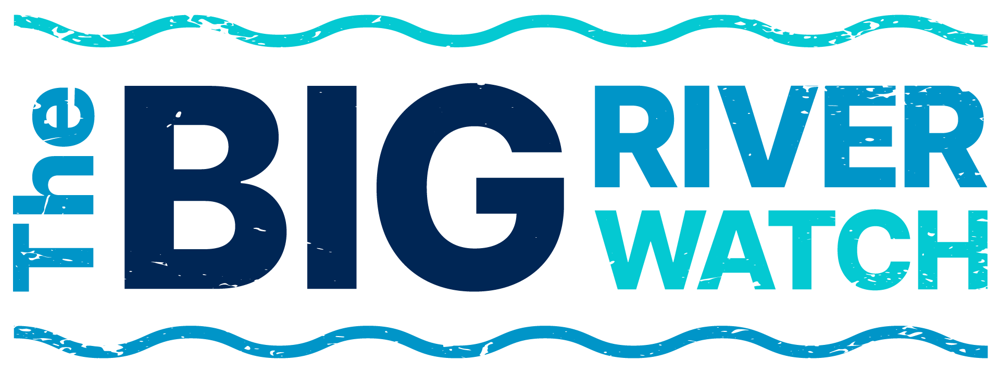

## The Big River Watch mobile app

### Help build a picture of river health across the country. It's good for you, and good for our rivers.

Whether you’re a swimmer or a paddler, an angler or a rambler, a wildlife spotter or a sit-and-watch-er, this is a chance to be part of the movement improving our freshwater spaces!

In just three easy steps, you will contribute to a national data set that will help us build a picture of river health across the country.

### What do I need to do?

- Step 1: Sign up
  Sign up and download the survey app to your phone before visiting the site.

- Step 2: Take part
  Pick a riverside location to join others around the country in collecting data about the health of your local river. You can complete the survey at your favourite local spot, or choose to get to know somewhere new!

- Step 3: Submit
  Submit your survey. We'll gather up all of your results and our data specialists will get busy analyzing the information so that The Rivers Trust and other environmental organizations can be better armed in the fight for healthier, wilder rivers.

### Why is Big River Watch needed?

Rivers are suffering from sewage, plastic, chemical and nutrient pollution. To change this, we need to know where our rivers are having the problems and which problems are the most prevalent. The free and open Big River Watch survey is your chance to make a difference. Data gathered during Big River Watch can support policy change; helping turn the tide on plastics or stem the flow of untreated sewage. It also helps identify the best places for river clean-ups, or the creation of things like wetlands.

[Read more](https://theriverstrust.org/take-action/the-big-river-watch)
